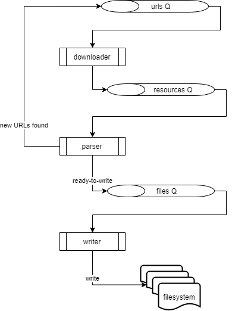

# py-offline

## Run

```
docker-compose up
```


## Configure

_Environment variables_

  * `PYOFF_URL` - the site page that needs to be crawled and downloaded
  * `PYOFF_DEPTH` - the depth of the crawl. Default is `0`, only the page's
  resources
  * `PYOFF_DESTINATION` - location where the site files are downloaded
  * `LOGLEVEL` - defaults to `"INFO"`


## Components



### Downloader

`download(url)` downloads resources (`HTML`, stylesheets, media, etc.) and
enqueues them for processing.

Subscribes to `q_urls`, with `url(url: str, depth: int = 0)`.

Produces to `q_resources`, with
`resource(url: str, depth: int, mimeType: str, contents: str)`.


### Parser

`parse(resource)` processes the contents of the resource, and decides what to
do next.

1. `HTML` documents are scanned for links to same domain; `URL`s are enqueued
to be downloaded
1. Others are enqueued to be writted on the fs.

Subscribes to `q_resources`.

Produces to `q_files`, with `file(name: str, content: str)`.


### Writer

`write(resource)` writes the resource to the filesystem.

Subscribes to `q_files`.


## Offline site

http://localhost:8000
